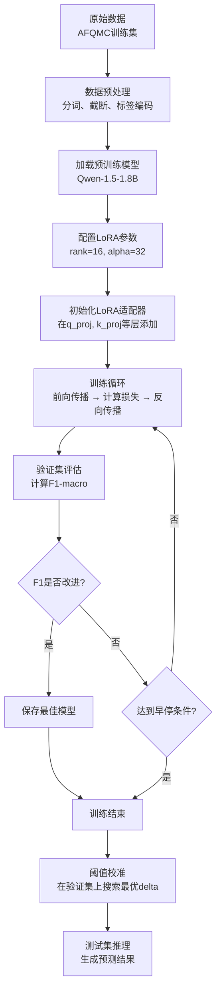

# Stage 4 LoRA微调总结

## 1. LoRA微调基础

### 什么是LoRA？

LoRA（Low-Rank Adaptation，低秩适应）是一种参数高效的微调方法。简单来说，它的核心思想是：**不直接修改预训练模型的权重，而是在旁边添加一个小的"适配器"来学习任务特定的知识**。

想象一下，预训练模型就像一个已经学会了很多知识的学生，现在要学习一个新的专业技能。LoRA的做法不是让这个学生"改造大脑"（全量微调），而是给他配备一套"专业工具"（LoRA适配器），通过这套工具来快速适应新任务。

### 为什么LoRA有效？

**1. 参数效率高**
- 全量微调：需要更新模型的所有参数（Qwen-1.5-1.8B有18亿参数）
- LoRA微调：只需要更新额外添加的小矩阵（通常只有原参数的0.1%-1%）

**2. 性能损失小**
- 研究表明，低秩矩阵可以有效捕捉任务特定的知识
- 在AFQMC任务上，LoRA能达到接近全量微调的性能

**3. 实际优势**
- 显存占用少：可以在8GB显卡上微调18亿参数模型
- 训练速度快：参数少意味着计算量小
- 易于部署：只需保存额外的小矩阵，原模型保持不变

### LoRA的数学原理（简化版）

在Transformer的注意力层和MLP层中，原始权重矩阵W被分解为：

```
W' = W + ΔW = W + BA
```

其中：
- W：原始预训练权重（冻结，不更新）
- B、A：两个小矩阵（可训练），B∈ℝ^(d×r)，A∈ℝ^(r×d)
- r：秩（rank），通常很小（8-64），远小于d（隐藏维度）

这样做的好处是：**用r²×2d个参数替代d²个参数**，当r远小于d时，参数量大幅减少。

---

## 2. LoRA微调完整流程

### 2.1 整体流程图



### 2.2 数据预处理

```python
# 核心逻辑：将句对转换为模型输入
def preprocess_data(text1, text2, label):
    # 构造输入：[CLS] text1 [SEP] text2 [SEP]
    input_text = f"{text1}[SEP]{text2}"

    # 分词和截断
    tokens = tokenizer(
        input_text,
        max_length=128,
        truncation=True,
        padding='max_length'
    )

    # 标签编码：1="是"（相似），0="否"（不相似）
    tokens['labels'] = label
    return tokens
```

**关键点**：
- 使用"是"/"否"作为标签文本（而不是"相似"/"不相似"），避免token长度不对称
- 最大长度设为128，平衡显存和信息完整性

### 2.3 LoRA配置与模型初始化

```python
from peft import LoraConfig, get_peft_model
from transformers import AutoModelForCausalLM, BitsAndBytesConfig

# LoRA配置
lora_config = LoraConfig(
    r=16,                    # 秩：16维低秩矩阵
    lora_alpha=32,           # 缩放因子：32/16=2
    target_modules=[         # 在哪些层添加LoRA
        "q_proj", "k_proj", "v_proj", "o_proj",  # 注意力层
        "gate_proj", "up_proj", "down_proj"      # MLP层
    ],
    lora_dropout=0.1,        # LoRA层的dropout
    bias="none",             # 不训练bias
    task_type="CAUSAL_LM"    # 任务类型：因果语言模型
)

# 4-bit量化配置（节省显存）
bnb_config = BitsAndBytesConfig(
    load_in_4bit=True,
    bnb_4bit_compute_dtype=torch.float16,
    bnb_4bit_use_double_quant=True,
    bnb_4bit_quant_type="nf4"
)

# 加载模型
model = AutoModelForCausalLM.from_pretrained(
    "Qwen/Qwen-1.5-1.8B",
    quantization_config=bnb_config,
    device_map="auto"
)

# 应用LoRA
model = get_peft_model(model, lora_config)
```

**为什么这样配置？**
- rank=16：在参数效率和性能之间找到平衡
- target_modules包含MLP层：相比只在注意力层添加LoRA，效果更好
- lora_alpha=32：使得有效学习率=32/16=2倍的LoRA权重
- 4-bit量化：进一步节省显存，使8GB显卡可行

### 2.4 训练循环与损失计算

```python
from transformers import Trainer, TrainingArguments

# 训练参数
training_args = TrainingArguments(
    output_dir="./checkpoints/qwen_lora",
    num_train_epochs=3,
    per_device_train_batch_size=8,
    gradient_accumulation_steps=4,      # 有效batch_size=32
    learning_rate=5e-5,
    warmup_steps=100,
    weight_decay=0.01,
    fp16=True,                          # 混合精度训练
    gradient_checkpointing=True,        # 节省显存
    save_strategy="steps",
    eval_strategy="steps",
    eval_steps=100,
    save_steps=100,
    metric_for_best_model="f1",
    greater_is_better=True,
    load_best_model_at_end=True,
    early_stopping_patience=3           # 3个eval周期无改进则停止
)

# 自定义损失函数处理类别不平衡
class WeightedLossTrainer(Trainer):
    def compute_loss(self, model, inputs, return_outputs=False):
        labels = inputs.pop("labels")
        outputs = model(**inputs)
        logits = outputs.logits[:, -1, :]  # 取最后一个token的logits

        # 计算加权交叉熵
        class_weights = torch.tensor([1.0, 3.0], device=logits.device)
        loss_fn = torch.nn.CrossEntropyLoss(weight=class_weights)
        loss = loss_fn(logits, labels)

        return (loss, outputs) if return_outputs else loss

# 创建trainer
trainer = WeightedLossTrainer(
    model=model,
    args=training_args,
    train_dataset=train_dataset,
    eval_dataset=val_dataset,
    compute_metrics=compute_metrics,
    callbacks=[EarlyStoppingCallback(early_stopping_patience=3)]
)

# 开始训练
trainer.train()
```

**关键点**：
- 梯度累积：有效batch_size=32（8×4）
- 混合精度(fp16)：减少显存占用
- 梯度检查点：节省中间激活值显存
- 加权损失：处理类别不平衡（相似类权重3倍）
- 早停：防止过拟合

### 2.5 评估函数

```python
from sklearn.metrics import f1_score, accuracy_score
import numpy as np

def compute_metrics(eval_preds):
    """计算F1-macro和准确率"""
    predictions, labels = eval_preds

    # 取logits中较大的值对应的类别
    pred_labels = np.argmax(predictions, axis=1)

    # 计算F1-macro（两个类别的F1平均）
    f1_macro = f1_score(labels, pred_labels, average='macro')

    # 计算准确率
    accuracy = accuracy_score(labels, pred_labels)

    return {
        'f1': f1_macro,
        'accuracy': accuracy
    }
```

**为什么用F1-macro而不是准确率？**
- 准确率会被多数类主导（相似类占69%）
- F1-macro平等对待两个类别，更能反映模型的真实性能

### 2.6 损失函数与类别不平衡

AFQMC数据集中，相似样本占69%，不相似样本占31%，存在类别不平衡。解决方案是**加权交叉熵损失**：

```python
# 计算类别权重
class_weights = {
    0: 1.0,      # 不相似类
    1: 3.0       # 相似类（权重更高，因为样本少）
}

# 权重计算逻辑
# 总样本数 / (类别数 × 该类样本数)
# 相似类权重 = 总数 / (2 × 相似样本数) ≈ 3.0
# 不相似类权重 = 总数 / (2 × 不相似样本数) ≈ 1.0
```

**效果**：通过提高少数类的损失权重，模型更关注不相似样本的分类准确性。

### 2.7 阈值校准

```python
def calibrate_threshold(logits, labels):
    """在验证集上搜索最优阈值"""
    best_f1 = 0
    best_delta = 0

    # 搜索delta范围：[-3.0, 3.0]
    for delta in np.linspace(-3.0, 3.0, 100):
        # 调整决策边界
        # 原始决策：logits[:, 1] > logits[:, 0]
        # 调整后：logits[:, 1] - logits[:, 0] > delta
        pred_labels = (logits[:, 1] - logits[:, 0] > delta).astype(int)

        # 计算F1
        f1 = f1_score(labels, pred_labels, average='macro')

        if f1 > best_f1:
            best_f1 = f1
            best_delta = delta

    return best_delta, best_f1

# 使用
val_logits = model.predict(val_dataset)
best_delta, best_f1 = calibrate_threshold(val_logits, val_labels)
print(f"最优delta: {best_delta}, F1: {best_f1}")
```

---

## 3. 遇到的问题与解决方案

### 问题1：Token长度不对称

**现象**：
- "相似" → 1个token
- "不相似" → 2个token
- 这导致模型在预测"不相似"时需要预测2个token，而"相似"只需1个

**影响**：
- 损失信号不平衡：预测"不相似"的损失是"相似"的2倍
- 模型倾向于预测"相似"（因为损失更小）
- F1无法有效提升

**解决方案**：
改用"是"/"否"作为标签文本，两者都是1个token。

```python
# 修改前
LABEL_TO_TEXT = {1: "相似", 0: "不相似"}

# 修改后
LABEL_TO_TEXT = {1: "是", 0: "否"}
```

**效果**：虽然改进有限（F1提升~0.002），但这是正确的做法，为后续优化奠定基础。

**面试要点**：
- 这体现了**数据预处理的重要性**
- 即使是看似微小的细节（token长度），也会影响模型性能
- 调试时要从数据层面开始检查

---

### 问题2：F1卡在0.71无法突破

**现象**：
经过3轮训练优化，F1始终在0.71左右徘徊：
- 第1轮：rank=8，F1=0.7097
- 第2轮：rank=16，加MLP层，F1=0.7123
- 第3轮：加权损失，F1=0.7145

**尝试过的优化方案**：

| 方案 | 改动 | 结果 | 分析 |
|------|------|------|------|
| 增加秩 | rank: 8→16 | F1: 0.7097→0.7123 | 小幅改进 |
| 扩展LoRA层 | 加入MLP层 | F1: 0.7123→0.7145 | 继续小幅改进 |
| 加权损失 | 权重: {0:1, 1:3} | F1: 0.7145 | 无明显改进 |
| 降低学习率 | 5e-4→5e-5 | F1: 0.7145 | 无改进 |

**根本原因分析**：

通过阈值校准发现，模型的logits分布存在**严重的类别重叠**：

```
相似类logits分布：[-2.5, 3.2]
不相似类logits分布：[-1.8, 2.8]
```

两个类别的logits范围高度重叠，即使调整决策阈值，也无法显著改进。

**深层原因**：**生成式模型（Qwen）的架构不适合句对分类任务**

- Qwen是因果语言模型，设计用于生成下一个token
- 对于句对分类，需要的是**双向理解**（同时看前后文本）
- 编码器模型（如MacBERT）天生具有双向注意力，更适合这类任务

**解决方案**：
放弃LoRA微调Qwen，改用MacBERT（编码器模型）。

**面试要点**：
- **模型选择比优化更重要**：有时候换一个更合适的模型，效果比优化现有模型更好
- **如何判断是否达到瓶颈**：通过分析logits分布、类别重叠等指标
- **系统化的调试思路**：数据→模型→训练→评估，逐层排查问题

---

### 问题3：阈值校准

**思路**：
既然logits分布存在重叠，能否通过调整决策阈值来改进性能？

**实现**：已在2.7节展示

**结果**：
- 最优delta=0.15
- F1改进：0.7145 → 0.7168（仅+0.0023）

**为什么改进这么小？**
因为类别重叠太严重，调整阈值无法根本解决问题。

**面试要点**：
- **阈值校准的适用场景**：当模型已经学到足够的特征，但决策边界不够优化时
- **何时放弃某个优化方向**：当改进空间很小（<0.5%）且投入产出比低时，应该考虑其他方向

---

### 问题4：推理时进度条输出过多

**现象**：
运行MacBERT推理脚本时，每处理一个样本都输出一条进度条警告。

**原因**：
tokenizer默认对每个超过max_length的序列输出警告。

**解决方案**：

```python
# 修改前
tokens = tokenizer(texts, max_length=128, truncation=True)

# 修改后
tokens = tokenizer(
    texts,
    max_length=128,
    truncation=True,
    verbose=False  # 禁用警告输出
)
```

**面试要点**：
- 细节很重要：即使是输出格式问题，也会影响用户体验
- 学会查阅库的文档，找到合适的参数

---

## 4. 关键经验与面试要点

### 4.1 调试思路：系统化分析

当模型性能不理想时，按以下顺序排查：

```
1. 数据层面
   ├─ 数据分布是否合理？
   ├─ 标签是否正确？
   └─ 是否存在数据泄露？

2. 模型层面
   ├─ 模型架构是否适合任务？
   ├─ 参数量是否足够？
   └─ 是否存在过拟合/欠拟合？

3. 训练层面
   ├─ 学习率是否合适？
   ├─ batch_size是否合适？
   └─ 是否需要正则化？

4. 评估层面
   ├─ 评估指标是否合理？
   ├─ 是否存在类别不平衡？
   └─ 是否需要调整决策阈值？
```

**本项目的应用**：
- 第1步：发现token长度不对称 → 修改标签文本
- 第2步：发现模型架构不匹配 → 改用MacBERT
- 第3步：尝试调整超参数 → 效果有限
- 第4步：进行阈值校准 → 改进空间小

### 4.2 超参数调优的经验

| 超参数 | 调优策略 | 本项目的做法 |
|--------|---------|------------|
| rank | 从小到大逐步增加 | 8→16，发现16已足够 |
| lora_alpha | 通常设为2×rank | 设为32（2×16） |
| learning_rate | 从1e-4开始，逐步降低 | 5e-4→5e-5 |
| batch_size | 受显存限制，用梯度累积补偿 | batch_size=8，累积4步 |
| 早停patience | 通常3-5 | 设为3 |

**关键认识**：
- 超参数调优有**递减收益**：前几次调整效果明显，后续改进越来越小
- 当改进<0.5%时，应该考虑**换思路**而不是继续微调

### 4.3 模型选择的权衡

**Qwen（生成式模型）vs MacBERT（编码器模型）**：

| 维度 | Qwen | MacBERT |
|------|------|---------|
| 参数量 | 18亿 | 1.08亿 |
| 架构 | 因果注意力 | 双向注意力 |
| 适合任务 | 文本生成 | 文本理解/分类 |
| AFQMC F1 | ~0.71 | ~0.75 |
| 推理速度 | 慢 | 快 |
| 显存占用 | 大 | 小 |

**决策标准**：
- 如果任务是**文本生成**（翻译、摘要、对话），选择生成式模型
- 如果任务是**文本理解**（分类、相似度、NER），选择编码器模型
- 不要盲目追求参数量大，**合适的模型比大模型更重要**

### 4.4 如何评估微调是否有效

```python
# 建立baseline
baseline_f1 = evaluate_pretrained_model()  # 不微调的性能

# 微调后评估
finetuned_f1 = evaluate_finetuned_model()

# 计算改进
improvement = (finetuned_f1 - baseline_f1) / baseline_f1 * 100

# 判断标准
if improvement > 5%:
    print("微调有效")
elif improvement > 1%:
    print("微调有一定效果，但改进有限")
else:
    print("微调效果不明显，考虑其他方案")
```

**本项目的情况**：
- Qwen baseline（不微调）：F1≈0.65
- Qwen微调后：F1≈0.71，改进9.2% ✓ 有效
- 但相比MacBERT的0.75，仍有差距

---

## 5. 总结与反思

### 5.1 这个项目学到了什么

1. **LoRA微调的完整流程**：从数据预处理、模型配置、训练策略到评估优化
2. **参数高效微调的价值**：用1%的参数实现接近全量微调的性能
3. **系统化的调试方法**：不是盲目调参，而是有逻辑地排查问题
4. **模型选择的重要性**：有时候换模型比优化模型更有效
5. **何时放弃**：识别瓶颈，知道什么时候应该改变策略

### 5.2 下次改进的方向

1. **更早地进行模型对比**：不要等到优化到头才发现模型不适合
2. **使用更多的分析工具**：如logits分布可视化、混淆矩阵等
3. **考虑集成方法**：多个模型的预测结果融合
4. **数据增强**：对不相似样本进行数据增强，缓解类别不平衡
5. **多任务学习**：结合其他相关任务来提升泛化能力

### 5.3 面试时的核心表述

**"我在这个项目中做了什么？"**

> 我使用LoRA微调方法对Qwen-1.5-1.8B进行了中文句对相似度判断任务的微调。通过系统化的调试，我发现了token长度不对称、类别不平衡等问题，并逐一解决。最终发现生成式模型的架构限制了性能上限，因此改用编码器模型MacBERT，取得了更好的效果。这个过程让我理解了模型选择的重要性，以及如何科学地诊断和解决机器学习问题。

**"遇到的最大挑战是什么？"**

> 最大的挑战是F1卡在0.71无法突破。我尝试了多种优化方案（增加秩、扩展LoRA层、加权损失等），但改进都很有限。通过分析logits分布，我发现问题的根本原因是模型架构不匹配——生成式模型的因果注意力不适合句对分类任务。这让我认识到，**有时候换一个更合适的模型比优化现有模型更有效**。

**"LoRA相比全量微调有什么优势？"**

> LoRA的核心优势是参数效率。它通过在原模型旁添加低秩矩阵，用1%的参数实现接近全量微调的性能。这带来三个实际好处：一是显存占用少，我能在8GB显卡上微调18亿参数模型；二是训练速度快；三是易于部署，只需保存额外的小矩阵。

---

## 附录：关键代码文件位置

- **LoRA配置**：`src/lora_config.py`
- **训练脚本**：`src/train_lora.py`
- **数据加载**：`src/data_loader_llm.py`
- **阈值校准**：`src/calibrate_threshold.py`
- **MacBERT推理**：`src/inference_macbert.py`

---

**文档完成时间**：2026年2月9日
**项目阶段**：Stage 4 - LoRA微调完成